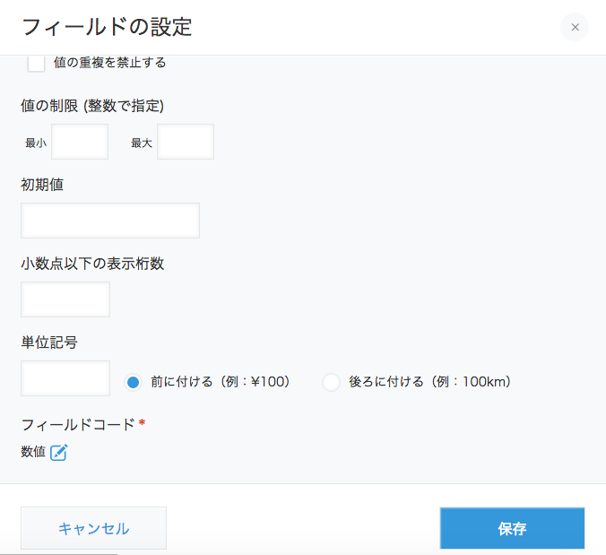

# 2016/05/30

## 本日のゴール

* IoTって何?ってのがちょっとわかる
* Kintoneといろいろなしくみが繋がることを理解する

## 事前知識

### IoTって何?

[Wikipediaの「モノのインターネット」](https://ja.wikipedia.org/wiki/%E3%83%A2%E3%83%8E%E3%81%AE%E3%82%A4%E3%83%B3%E3%82%BF%E3%83%BC%E3%83%8D%E3%83%83%E3%83%88)を参考に。

今迄は人間がインターネットを便利に使っていますが、これからの未来においては人以外の「モノ」がインターネットに情報を発信したり、インターネットから取得したデータを使用したりするという状況を指しています。

#### 事例

* [農業経験者ゼロからのスタート
kintone を使ったデータ管理により、製販の需給調整の精度が劇的に向上 販売ロスが0.04%に](https://kintone.cybozu.com/jp/case/introduction51.html)
* [つながるクルマ](http://nttd-mse.com/iot/car/)

こういった事例の中からデータを収集する窓口としてKintoneを使用することができます。

### Kintone REST API

何かしらのシステムとやりとりをする際には「プロトコル」を決めておく必要があります。

Kintoneとやりとりをする際にはHTTPSを使用してやりとりを行ないます。その時にデータを送信する時の約束事として[Kintone REST API]というものが決められています。

Kintone REST APIを通して外部のシステムからKintoneにデータを呼び出したり登録したりできます。

## 本日の課題

### Arduinoで取得した情報をKintoneに送る

Arduinoという小型コンピューターを用意しました。さらにArduinoに接続可能なセンサーを2つ用意しました。
(温度を取得するセンサーと明るさを取得するセンサー)。

今回はArduinoの中でも「ESP-WROOM-02」という無線LANに接続できるArduinoを使用します。

そのセンサーから取得した情報をKintoneに送信してデータを表示してみてください。

#### 準備すること

##### センサーを決める

まず使用するセンサーを決めます。在庫状況にもよるので事前に講師に確認してください。

* 明るさ
* 温度

のいずれかのセンサーを使用します。

##### Kintoneアプリを作る

次に、Kintone側で受け取り用のアプリを作り、認証用のキーを発行します。

はじめに普通にアプリを作ります。特に何かあるわけでもないので「はじめから作成」を選択します。


Step2のアプリの一般設定までは適当に進めて、Step3のフォームの編集に行きます。


フォームを追加していきます。今回は「作成日時」と「数値」のフォームを追加します。
追加したら「数値」のフォームの設定を変更します。


編集画面の一番下までスクロールすると「フィールドコード」と書かれた部分がありますので、編集用のアイコン(エンピツのアイコン)をクリックし、フィールドのコード(JavaScriptや外部のプログラムからアクセスする時の名前)を設定します。

ここが日本語になっている場合、プログラムからデータを登録する際に失敗する可能性があるので英語で設定します。

使用するセンサーが「明るさ」の場合は「lux」、「温度」の場合は「temp」にしてください。



設定したら、保存ボタンを押してください。
フォームの編集も終了します。

次に一覧の作成になりますが、適当に作成日時と数値を表示する一覧を作ってください。

一覧まで作成したら「設定完了」ボタンを押す前に下にある「その他の設定」をクリックし、さらに「高度な設定」の中にある「APIトークン」をクリックします。


APIトークンとはこのトークンを知らない人が自分のアプリにアクセスできないようにするための認証情報になります。
ですので、**この情報は絶対に外部の人(知り合いでも)に漏れないようにしてください。**

画面中にある「生成する」ボタンをクリックするとAPIトークンが生成されます。


今回、Arduinoからはデータの登録しかしませんのでアクセス権には「データの追加」にだけチェックが入った状態にしておいてください。

(なお、この画面に表示されているAPIトークンは既に無効化されていますので入力しても意味ありません)

生成が終わったら「保存」ボタンをクリックし、「作成完了」ボタンを押してアプリケーションの運用を開始してください。

##### Arudino IDEをダウンロード/インストールする

Ubuntuを使用している学生は事前に

    sudo addgroup user dialout

を実行後、再起動してから続きを行なってください。

Arduinoで動作するプログラムを作るためにArduino IDEというソフトが必要になります。[Arudinoの公式サイト]からダウンロードします。

(Ubuntuの場合、`apt install arduino`ってやればインストールできるんですが、バージョンが古すぎるので…)

Macの場合は.dmzをダブルクリックしてApplicationsディレクトリにドラッグアンドドロップするだけです。

Ubuntuの場合は64bit版をダウンロードして、展開後、ターミナルでinstall.shを実行してください。

あと、[ESP-WROOM-02用の設定](http://esp8266.github.io/Arduino/versions/2.0.0/doc/installing.html)をWebページを参考にして行なってください。
(Using git version)の手前までで大丈夫です。

最後にArduino IDEが起動したら「Tool」メニューの「Reset Method」を「nodemcu」に変更します。(これをやらないとArduinoにプロフラムを書き込みできません…)


##### Arduinoでプログラムを動かす

ここから先、「Arduinoのライブラリディレクトリ」という言葉が出てきたら

* Macの場合はファインダーから「書類 → Arduino → libraries」へ
* Linuxの場合は`~/Arduino/libraries`

のことを指してると思ってください。

----

Arduinoでセンサーから値を取得してkintoneに投稿するまでのプログラムを用意してあるのですが、追加のインストール作業が必要なので下記のインストール作業を行なってください。

* [MCP9808 Library](https://github.com/adafruit/Adafruit_MCP9808_Library/archive/master.zip)をダウンロードして、展開後、ディレクトリごとArduinoのライブライリディレクトリへ移動します(これは温度センサー用)。
* [TSL2591 Library](https://github.com/adafruit/Adafruit_TSL2591_Library/archive/master.zip)をダウンロードして、展開後、ディレクトリごとArduinoのライブライリディレクトリへ移動します(これは輝度センサー用)。
* [Adafruit Sensor Library](https://github.com/adafruit/Adafruit_Sensor/archive/master.zip)をダウンロードして、展開後、ディレクトリごとArduinoのライブライリディレクトリへ移動します(これも輝度センサー用)。

#### 実際に動かしてみよう

ESP-WROOM-02を各PCとUSBケーブルで接続し、Arduino IDEを起動します。

起動後、それぞれのセンサーに応じたソースコードをコピペしてください。

* MCP9808の場合は[Arduino/Temp](Arudino/Temp/)を開いてTemp.inoをArduino IDEにコピペし、floatToString.hをArudinoのプロジェクトディレクトリに保存します。
* TSL2591の場合は[Arduino/Lux](Arduino/Lux/)のLux.inoをコピペします。

コピペ後、ソースコード中の下記の部分を自分のkintoneアプリに合わせて書き換えます。

````
//ACCESS POINT

const char* toSSID = "Replace to your SSID"; ← Wireless AccessPointのSSID
const char* key = "Replace to your PSK"; ← アクセスポイントのPSK
WiFiClientSecure client;


// Setting for Kintone
const char* HOST = "xxx.cybozu.com"; // Kintoneのホスト名
const int   PORT = 443;
const int   APPID = 10; // KintoneのアプリケーションID
const char* PATH = "/k/v1/record.json";
const char* APITOKEN = "??????"; // 作成したAPIトークン
````

あとはコンパイル/実行します。左上にある「→」のボタンを押すとコンパイルされ、Arduinoにプログラムが転送されます。


上手くいけば、光センサーの場合は1分ごとに、温度センサーの場合は5分ごとにデータが登録されます。

うまく登録された場合、その情報を集計してみる「一覧」を作ってみてください。
